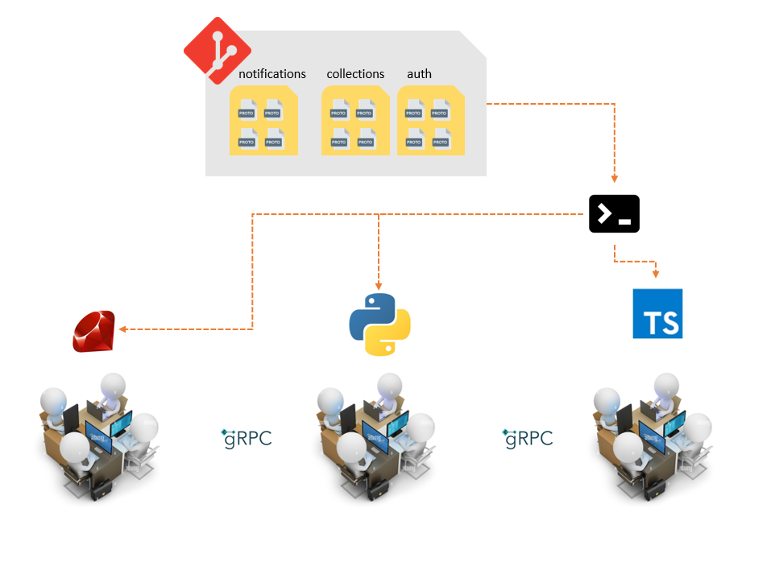

# Protobuf Manipulator

This console program is designed to allow the sharing of .proto files between different teams in the company, regardless of the programming language used.



## Build the app

```bash
# windows
$ GOOS=windows GOARCH=amd64 go build -o pro.exe src\main.go

# mac
$ GOOS=darwin GOARCH=amd64 go build -o pro src\main.go

# linux
$ GOOS=linux GOARCH=amd64 go build -o pro src\main.go
```

## CLI

```bash
# download to a specific local path
$ pro -route=folder

```
